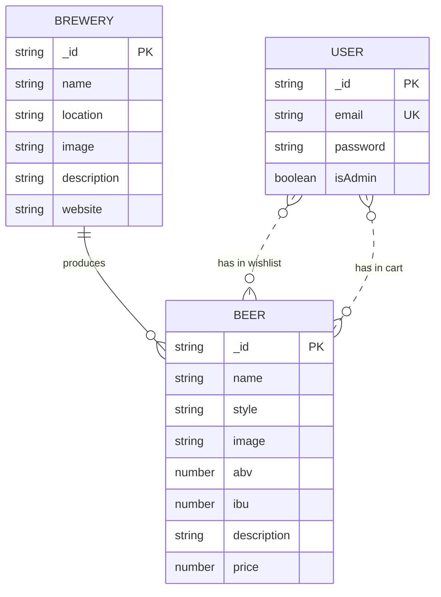

# craft-beer-shop

## Table of Contents

* [General Info](#general-info)
* [Features](#features)
* [Technologies](#technologies)
* [Database Model](#database-model)
* [API Documentation](#api-documentation)
* [Project Assignment](#project-assignment)
* [Getting Started](#getting-started)
* [Credits](#credits)

## General Info

craft-beer-shop is a MERN stack application for a craft beer shop offering e-commerce management and showcasing beers and breweries. 🍺🛒

> Project created as a final project for university subject:  
> *DPR002 - Advanced Web Programming*  
> *University of Split - University Department of Professional Studies*


## Features

- User authentication (register, login, logout)
- User roles (admin, regular user)
- JWT token authentication and authorization
    - API endpoints that return data are protected by requiring a JWT token
    - Protected routes (only admin can access create, update, delete operations) by using middleware
- Beer overview (list, details)
- Brewery overview (list, details)
- Managing beers and breweries (CRUD operations)
- Managing users (CRUD operations, only admin)
- Shopping cart (add, remove, base functionality for checkout)
- Favorites (add, remove)

## Technologies


  


  


  


## Database Model



## API Documentation

API documentation is available at [https://documenter.getpostman.com/view/23709383/2sA2r7zNew](https://documenter.getpostman.com/view/23709383/2sA2r7zNew).

## Project Assignment

### Task

Create an application for browsing a craft beer shop. Use the Express.js framework and MongoDB for modeling the API.

Create models for the beer and brewery. Each beer should have characteristics such as price, alcohol percentage, color, type (IPA, lager, stout, porter), etc. Each beer should have a brewery, which in this case, would be a craft brewery (Medvedgrad, Zadruga, Brlog, etc.). The brewery should have some information about itself such as the year of establishment, country, a brief company description, and a URL to the logo.

Create the user interface using the React library. The website will consist of pages for beer overview, details, all breweries, entering a new beer, entering a new brewery, as well as pages for editing or deleting existing beers and breweries (a brewery cannot be deleted if there are beers associated with it). CRUD operations on beers/breweries are only allowed for users with an administrator role. Regular users have only the option to view existing beers/breweries. The homepage should display a list of beers with basic information. Beers should be grouped (sorted) alphabetically by brewery. Clicking on a specific beer should lead to a page with details about that beer. Also, allow viewing details about the brewery.

Furthermore, protect data routes (API endpoints that return data) on the server-side by requiring a Json Web token. To generate a JWT token, the user should log in to the application. Create Login, Logout, and Register pages on the client-side, and corresponding API endpoints on the server-side. Ensure proper user navigation through the user interface. Provide Login and Logout buttons depending on the login status. After successful registration, take the user to the login page. After successful login, take the user to the homepage (list of beers with basic information). After logout, take the user to the login page. Finally, in case of an invalid token (the server-side refused to return data), take the user to the login page. Take care of the user role for permission to CRUD operations on users.

### Additional Features

Add functionality for a "shopping cart". The user has the ability to add/remove beers from the shopping cart, and add/remove beers to the list of favorite beers. By pressing the check-out button, the contents of the shopping cart are emptied.

### Seminar Defense Practical Task

1. Create another API endpoint for editing the data of all registered users. Protect the endpoint with a JSON Web Token. Only the user who is an administrator has access to view registered users. All user data can be modified except for the password. Develop a separate component to display data about users who wish to update. The component displays prepopulated user data: user name (or email) and role.
2. The second task is a continuation of the first. Next to the name of each user, there is a link leading to the page for changing the password. Changing the password will be done as follows: On the change page, there is a field where the old password is entered (as plain text). If it is confirmed that this is the user's password from the database (comparing hashes), then it is possible to proceed to the step of obtaining a new password, hashing it, and replacing the old hash in the database with the new one.

## Getting Started

### Prerequisites

- Node.js
- npm
- MongoDB Atlas account (or local MongoDB server)

### Installation

1. Clone the repository
   ```sh
   git clone git@github.com:anamarijapapic/craft-beer-shop.git
    ```
2. Position to the project folder
    ```sh
    cd craft-beer-shop
    ```
3. Position to the server folder
    ```sh
    cd server
    ```
4. Copy the `config.env.example` file and rename it to `config.env` in the server folder. Fill in the environment variables with your own values.
    ```sh
    cp config.env.example config.env
    ```
5. Install server dependencies
    ```sh
    npm install
    ```
6. Seed the database with initial data
    ```sh
    npm run seed
    ```
7. Start the server
    ```sh
    npm start
    ```
8. Open another terminal and position to the client folder
    ```sh
    cd client
    ```
9. Copy the `.env.local.example` file and rename it to `.env.local` in the client folder. Fill in the environment variables with your own values.
    ```sh
    cp .env.local.example .env.local
    ```
10. Install client dependencies
    ```sh
    npm install
    ```
11. Start the client
    ```sh
    npm start
    ```
12. Open your browser and go to [http://localhost:3000/](http://localhost:3000/)

## Credits

- [Anamarija Papić](https://github.com/anamarijapapic)
